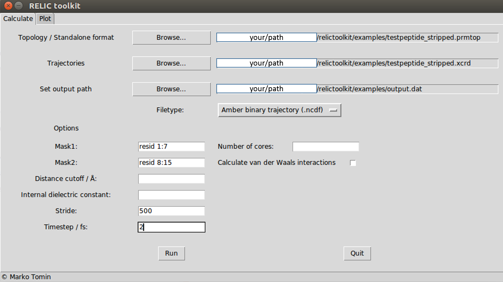

# **RELIC**                                 
## Residue ELectronic Interaction Calculator

RELIC toolkit calculates the electrostatic interaction throughout the molecular dynamics trajectory. The interactions between user-defined regions are calculated on a per-residue bases. Relic can read AMBER, CHARMM, DESRES, GAMESS, GROMACS, GROMOS96, GSD, HOOMD and LAMMPS trajectories. 
Tracking the evolution of electrostatic interactions over the simulation time allows for identification of the residue-residue interactions that are the driving force behind the observed process.

## Citing RELIC
When publishing results obtained using RELIC please cite this publication:

(to be added)

## Installation
To install the RELIC toolkit, download the zip from GitHub, extract it to a directory of your choice and run:
	
	$ python setup.py install
	
Alternatively, you can install it with pip. If you don't have numpy installed, first install it with

    $ pip install numpy
    
And then install RELIC toolkit with

    $ pip install git+https://github.com/mtomin/relictoolkit.git

### Requirements
* Linux
* Python 2.7 and up

### Dependencies
- [setuptools](https://pypi.org/project/setuptools/)
- [numpy](http://www.numpy.org/)
- [matplotlib](https://matplotlib.org/)
- [six](https://pypi.org/project/six/)
- [requests](http://docs.python-requests.org/en/master/)
- [gsd](https://gsd.readthedocs.io/en/stable/python-api.html)
- [MDAnalysis](https://www.mdanalysis.org/)
- [decorator](https://pypi.org/project/decorator/)
- [plotly](https://plot.ly/python/)
- [pytz](https://pypi.org/project/pytz/)
- [traitlets](https://pypi.org/project/traitlets/)
- [validators](https://pypi.org/project/validators/)
- [future](https://pypi.org/project/future/)
- [configparser](https://pypi.org/project/configparser/)
- [duecredit](https://pypi.org/project/duecredit/)

## Testing
The installation can be tested by running:

	$ python setup.py test

which checks if all the core modules are working properly

#### Testing dependencies:
- [pytest](https://pypi.org/project/pytest/)
- [pytest-cov](https://pypi.org/project/pytest-cov/)
- [mock](https://pypi.org/project/mock/)

## Usage
The `setup.py` script creates the executable file in the /bin directory and the program can be run with:

	$ relictoolkit

In addition to the built-in GUI, calculation and plotting scripts can be run as standalone scripts:

	$ python relictoolkit_calculate path/to/config/file
	$ python relictoolkit_plot path/to/config/file

In this case, it is necessary to manually create the config.ini or config_plot.ini files containing the calculation/plotting parameters.

## Quick start
The examples folder contains a short simulation of a peptide comprised of 15 amino acid residues (HRERFLADKSAPLCG).
This tutorial will go through calculating interactions between the first (residues 1-7) and second (residues 8-15) half of the protein.

#### Calculation
In the Calculate tab navigate to the topology and trajectory files located in the relictoolkit/examples folder. Set the location of the output file and make sure the filetype "Amber binary trajectory (.ncdf)" is selected.
Mask1 and Mask2 define the regions of the studied system. In our case, Mask1 contains residues 1 to 7, whereas Mask2 contains residues 8-15. RELIC uses the [MDAnalysis selection syntax](https://www.mdanalysis.org/docs/documentation_pages/selections.html), so to select appropriate residues enter:

	Mask1: resid 1:7
	Mask2: resid 8:15

If left empty, distance cutoff defaults to 5 &#197;, internal dielectric constant defaults to 4, stride defaults to 1000 and timestep to 1 fs. In this example, we will use a stride of 500 to generate enough data for a decent plot later. A timestep used in the simulations was 2 fs. The interface should now look like this:

Enter the desired number of cores and hit run. The calculation time should not exceed 2 minutes with a single core. The process can be tracked using the logfile:

	$ tail relic_logfile.log

#### Plotting
Upon selecting the output file obtained in the previous part of the tutorial, the settings pane appears. The default settings can be used (plot against time, include all frames and all residues). After hitting run, the graph is created and automatically opened.
The graph can be further customized using Plotly's [Chart studio](https://plot.ly/online-chart-maker/) or exported to png file using the action menu bar in the upper right corner.

It can be observed that residues Glu3 and Lys9 contribute most to the interactions between the first and the second half of the peptide. Those interactions are beginning to form at around 1.9 ns, while at that time residues 2 and 4 formed destabilizing interactions, mostly with Lys9.

## Troubleshooting
In case of dependency issues, try creating a clean environment with [anaconda](https://www.anaconda.com/download/#linux) or [miniconda](https://conda.io/miniconda.html):

    $ conda create myenv python --no-default-packages
    $ source activate myenv

And retry the installation.

If you are having issues with the "traditional" setuptools installation, try installing via pip.

## License
RELIC is distributed under the [CC-BY](https://creativecommons.org/licenses/by/4.0/) license.
